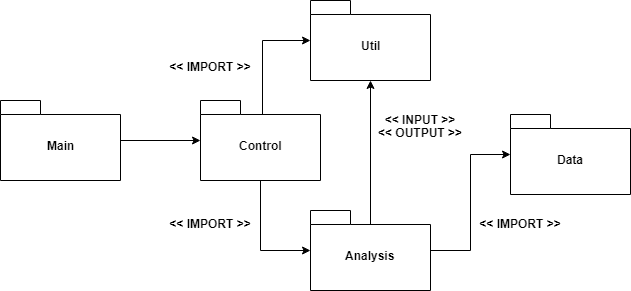
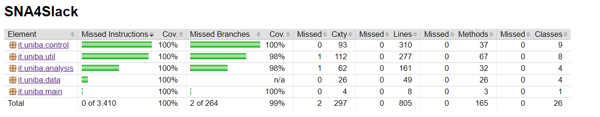
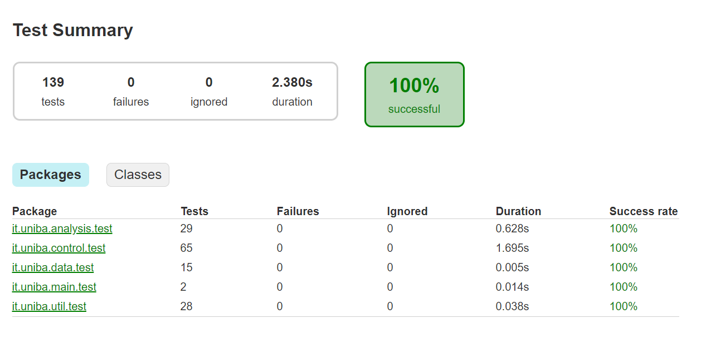

# Benvenuto in SNA4SLACK
## 1. Introduzione
SNA4Slack (Social Network Analysis for Slack) è un applicativo atto ad analizzare e mostrare risultati di eleborazioni richieste dall'utente sull'applicativo social "Slack".
L'utente richiede le elaborazioni attraverso specifici comandi in input che rappresentano gli argomenti dell'applicativo durante l'esecuzione.
## 2. Modello Concettuale
## 3. Requisiti Specifici 
I requisiti specifici di SNA4Slack sono i seguenti :
 - In qualità di utente voglio visualizzare la lista dei **Member**
 - In qualità di utente voglio visualizzare la lista dei **Channel**
 - In qualità di utente voglio visualizzare la lista dei **Member**
   raggruppati per **Channel**
 - In qualità di utente voglio visualizzare la lista dei **Member** di un **Channel**
 - In qualità di utente voglio poter avere informazioni di **Help**
 - In qualità di utente voglio visualizzare la lista dei **@mention**
 - In qualità di utente voglio visualizzare la lista dei **@mention** che
   partono da uno **User**
 - In qualità di utente voglio visualizzare la lista dei **@mention** che
   arrivano a uno **User**
 - In qualità di utente voglio visualizzare la lista pesata dei **@mention**
 - In qualità di utente voglio visualizzare la lista pesata dei **@mention**
   che partono da uno **User**
 - In qualità di utente voglio visualizzare la lista pesata dei **@mention**
   che arrivano a uno **User**

## 4. Architettura
L'applicativo utilizza lo stile architetturale "**Layered**" in cui ogni strato non ha conoscenza degli altri ma utilizza un API per richiamare una componente dello strato inferiore.
L'applicativo è diviso nei seguenti package :

**Immagine dei vari componenti**
La scelta dello stile "**Layered**" è stata adottata per integrare i principi SOLID e rendere ogni strato indipendente e non ridondante.
Ogni **package** contiene solo classi che rispettano le funzioni indicate dal nome.
Nel package **Data** sono inserite tutte le classi che modellano le componenti atomiche di Slack e la classe Counter che memorizza il numero di mentions effettuate da un determinato Member (From) ad un altro (To).
> Member , Channel , Mention e Counter

Nel package **Analysis** sono contenute la super classe Analysis e tutte le sue generalizzazioni.
> MembersAnalysis , ChannelsAnalysis e MentionsAnalysis.

Il package **Control** esegue i controlli sull'input utente attraverso le classi legate ai diversi requisiti specifici.
Il package **Util** contiene le classi che gestiscono l'input e l'output e alcune classi di supporto
> I/O : JSONReader , ZipReader e le classi che implementano l'interfaccia Printer

## 5 System Design
- In qualità di utente voglio visualizzare la lista dei **Member**

- In qualità di utente voglio visualizzare la lista dei **Channel**

- In qualità di utente voglio visualizzare la lista dei **Member** raggruppati per **Channel**

- In qualità di utente voglio visualizzare la lista dei **Member** di un **Channel**

## 6 Riepilogo dei Test
Le seguenti immagini mostrano la copertura dei test e il numero di test 
effettuati 

## 7 Manuale Utente
Questa è la lista dei comandi eseguibili dall'utente

membersList zipPath
> Show members list in selected workspace with zipPath

channelsList zipPath
> Show channel list in selected workspace with zipPath

membersChannel channelName zipPath
> Show member list in selected channel in selected workspace with zipPath
 
membersSortedByChannel zipPath
> Show members sortedy by channel in selected workspace with zipPath
 
mentionsList zipPath
>Show mentions list in selected workspace with zipPath

mentionsListChannel channelName zipPath
> Show mentions list in selected channel in selected workspace with zipPath

mentionsListFrom member zipPath
> Show mentions list from selected member in selected workspace with zipPath

mentionsListFrom member channel zipPath
> Show mentions list from selected member in selected channel in selected workspace with zipPath

mentionsListTo member zipPath
> Show mentions list to selected member in selected channel in selected workspace with zipPath

mentionsListTo member channel zipPath
> Show mentions list to selected member in selected channel in selected workspace with zipPath

mentionsListWeighed zipPath
> Show mentions list weighed in selected workspace with zipPath

mentionsListChannelWeighed channel zipPath
> Show mentions list weighed in selected channel in selected workspace with zipPath

mentionsListFromWeighed member zipPath
> Show mentions list weighed from selected member in selected workspace with zipPath

mentionsListFromWeighed member channel zipPath
> Show mentions list weighed from selected member in selected channel in selected workspace with zipPath

mentionsListToWeighed member zipPath
>Show mentions list weighed to selected member in selected workspace with zipPath

mentionsListToWeighed member channel zipPath
> Show mentions list weighed to selected member in selected channel in selected workspace with zipPath

sna4slack
> Show this help interface

## 8. Processo di sviluppo e organizzazione del lavoro

 - Progettazione e Implementazione
 > Donato Leone e Giacomo Diaferio
 
 - Test e Revisione
 > Simone Cancellaro e Lorenzo Liberti

- Risoluzione problemi CheckStyle
> Donato Leone e Simone Cancellaro

- Risoluzione problemi PMD e FindBugs
> Donato Leone

- JUnit
> Donato Leone e Giacomo Diaferio

- Documentazione 
> Simone Cancellaro e Lorenzo Liberti

Il lavoro è stato svolto attraverso una serie di Meeting Face to Face 
## 9. Analisi Retrospettiva 
- Cosa ha funzionato bene e rifarei in futuro
> Un ottimo team che ha diviso equamente i vari compiti durante i diversi Sprint
- Cosa non ha funzionato bene e non rifarei in futuro
> Consegna in largo anticipo
- Cosa farei di nuovo 
> Se dovesse ripalesarsi la possibilità di poter collaborare con qualcuno, sarebbe piacevole grazie a questa esperienza lavorare nuovamente con gli stessi elementi del team BernersLee
